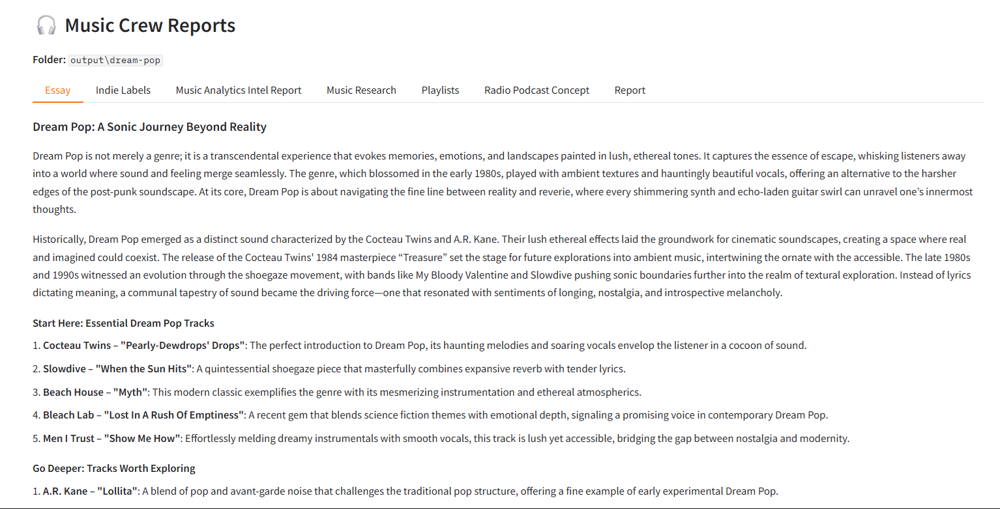

# Music Crew

Generate deep, structured music genre reports (history, current scene, recommendations, and a 3–5 year outlook) using CrewAI — and optionally view the reports in a Gradio tabbed UI.




## Features

- Generate long-form genre research reports from a single prompt
- Covers:
  - key history + turning points
  - what’s happening now (artists, scenes, releases)
  - recommendations (artists + starter tracks)
  - 3–5 year outlook (signals + possible disruptors)
- Writes multiple Markdown files per run into `output/<genre>/`
- Optional Gradio UI (`--ui`) that renders each report in tabs
- Includes a sample report in `example/dream-pop/`

## Prerequisites
- Python 3.10+ (3.11 recommended)

## Setup
Clone the repo:

```bash
git clone https://github.com/DarwinJavier/music-crewai.git
cd music-crewai
```

## Create a Virtual Environment
```bash
python -m venv .venv
```
### Windows:
```bash
.venv\Scripts\activate
```
### macOS/Linux:
```bash
source .venv/bin/activate
```
## Install Dependencies
```bash
pip install -e .
```
## Configure Environment Variables
```bash
cp .env.example .env
```
Then open .env and add your keys.

## Run

Generate reports for a genre:
```bash
python -m music.main --topic "Dream Pop"
```
Generate reports and launch the Gradio UI:
```bash
python -m music.main --topic "Dream Pop" --ui
```
## Output

Each run creates a folder based on the topic slug and writes the Markdown files there:

output/dream-pop/

output/shoegaze/

output/midwest-emo/

## Example

A sample output is available here:

example/dream-pop/

## License
MIT
